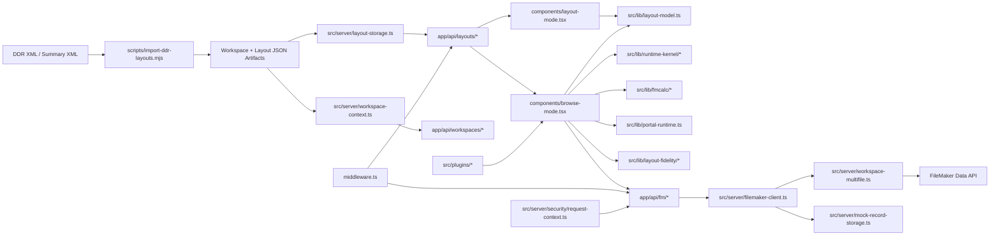

# FMWeb IDE Baseline Report

Generated: fingerprint:331e02f4d6acc207

## Toolchain Discovery

| Tooling | Detected Value |
| --- | --- |
| Package manager | npm |
| Next.js | ^16.1.6 |
| React | ^19.1.0 |
| TypeScript | ^5.7.3 |
| TS strict | true |
| Linting | eslint, eslint-config-next |
| Test script count | 46 |

## Architecture Inventory

| Inventory | Count |
| --- | --- |
| API route handlers | 41 |
| Components | 7 |
| Library modules | 107 |
| Server modules | 58 |

## Feature Inventory (Design + Runtime)

| Area | Current State | Primary Evidence |
| --- | --- | --- |
| Layout Mode | Large visual design surface with inspector, object tools, portal setup, app-layer managers | components/layout-mode.tsx; src/lib/layout-model.ts |
| Browse/Find/Preview | Metadata-driven runtime with found sets, edit session, list/table/preview, portals | components/browse-mode.tsx; src/lib/find-mode.ts; src/lib/edit-session/index.ts |
| DDR Ingestion | Import script + workspace import route normalizing DDR into workspace artifacts | scripts/import-ddr-layouts.mjs; app/api/workspaces/import/route.ts |
| Data API | Server proxy with multi-file routing, retries, circuit handling, mock fallback | src/server/filemaker-client.ts; src/server/workspace-multifile.ts |
| Scripting/Runtime Kernel | Kernel + script engine + variables + transaction manager + triggers | src/lib/runtime-kernel/*; src/lib/triggers/* |
| Security | Middleware auth, request guards, csrf, authorization, audit logging | middleware.ts; src/server/security/*; src/server/audit-log.ts |
| Testing | Broad node test suites plus layout fidelity and perf scripts | package.json scripts; scripts/layout-fidelity.mts; scripts/bench-perf.mts |

## Module Map

| Subsystem | Modules |
| --- | --- |
| Entrypoints | app/page.tsx app/layouts/[id]/edit/page.tsx app/layouts/[id]/browse/page.tsx components/layout-mode.tsx components/browse-mode.tsx |
| Layout Mode modules | components/layout-mode.tsx src/lib/layout-model.ts src/lib/layout-arrange.ts src/lib/tab-order.ts |
| Browse Mode modules | components/browse-mode.tsx src/lib/edit-session/index.ts src/lib/find-mode.ts src/lib/list-table-runtime.ts src/lib/portal-runtime.ts |
| DDR modules | scripts/import-ddr-layouts.mjs app/api/workspaces/import/route.ts src/server/layout-storage.ts |
| Data API modules | app/api/fm/records/route.ts app/api/fm/find/route.ts src/server/filemaker-client.ts src/server/workspace-multifile.ts |
| Security modules | middleware.ts src/server/security/request-context.ts src/server/security/csrf.ts src/server/security/session-store.ts src/server/security/authorization.ts |
| Plugin modules | src/plugins/manager.ts src/plugins/registry.ts src/plugins/runtime.ts |

## Runtime/Data Flow Summary

- State management: Hybrid: local React state plus dedicated runtime kernel modules for found sets/windows/scripts/context; Large mode components rely heavily on local useState/useMemo/useEffect state
- Data access: Server-side FileMaker Data API adapter; API proxy routes under app/api/fm/*; Workspace multi-file routing and DB-aware target resolution; Mock fallback storage for offline/dev execution
- Storage: Layout JSON persistence in workspace/data directories; Workspace-scoped config and metadata storage; Saved find/found set persistence; Workspace versioning snapshots; App-layer manager state storage
- Rendering pipeline: DDR importer script normalizes XML into workspace layout artifacts; Shared layout model used by design and runtime surfaces; Anchor/style/interaction fidelity engines present; Mode renderer parity path not fully detected
- Security posture: Next middleware enforces auth, security headers, and correlation ids; Per-route authz + CSRF guard utility; CSRF validation module; Session/JWT/trusted-header auth handling; Structured audit logging module

## Architecture Diagram (Mermaid)

## Known Gaps & Risks

- Multi-file routing depends on workspace mapping completeness; missing API layout mappings can surface runtime save errors.
- Mode switching and route-state synchronization are high-risk for recursive update loops in large browse-mode component state.
- App-layer breadth is large; capability gating drift can happen unless matrix coverage is enforced in CI.

## FileMaker Parity Notes

When behavior certainty is limited, this audit marks assumptions and recommends validation tests in the parity matrix and test plan.
